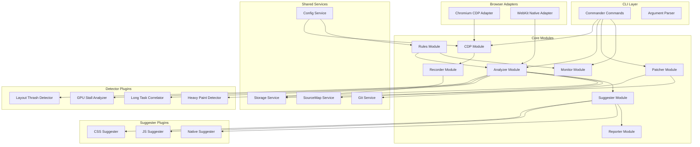
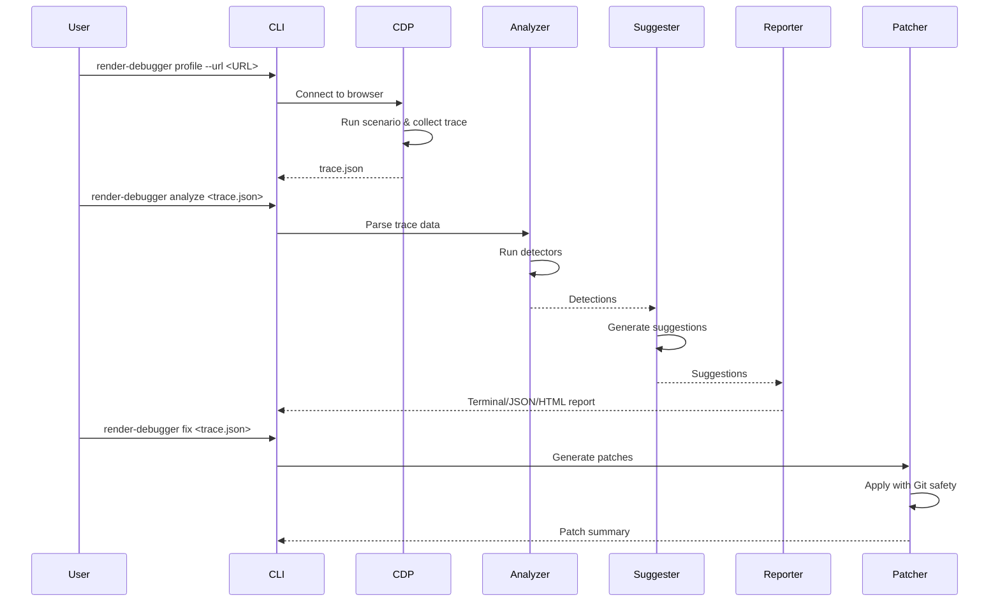

# render-debugger

A production-ready CLI tool for profiling Chromium-based browsers via the Chrome DevTools Protocol (CDP), identifying rendering bottlenecks across the browser pipeline, and generating actionable fixes with optional auto-apply capabilities.

## Overview

`render-debugger` helps browser engineering teams identify and fix rendering performance issues by:

- **Profiling** web pages under reproducible scenarios via CDP
- **Analyzing** traces to detect layout thrashing, GPU stalls, long tasks, and heavy paints
- **Suggesting** safe, conservative fixes with estimated speedup percentages
- **Patching** code automatically with Git integration and safety checks
- **Monitoring** performance continuously with configurable alerts
- **Comparing** traces to detect regressions in CI/CD pipelines

## Architecture



## Data Flow



## Modules

### CDP Module (`src/cdp/`)
Handles Chrome DevTools Protocol communication for browser connection and trace collection.
- `cdp-connection.service.ts` - WebSocket connection management with retry logic
- `tracing.service.ts` - Trace collection with configurable categories

### Recorder Module (`src/recorder/`)
Orchestrates profiling sessions and scenario execution.
- `recorder.service.ts` - Profile orchestration
- `scenario-runner.service.ts` - YAML scenario parsing and execution

### Analyzer Module (`src/analyzer/`)
Coordinates detection and analysis of trace data.
- `analyzer.service.ts` - Main analysis orchestration
- `detectors/` - Pluggable detector implementations:
  - `layout-thrash.detector.ts` - Detects read-after-write DOM patterns
  - `gpu-stall.detector.ts` - Detects GPU sync stalls and texture uploads
  - `long-task.detector.ts` - Detects tasks >50ms blocking main thread
  - `heavy-paint.detector.ts` - Detects expensive paint operations
- `scoring/` - Confidence and speedup estimation

### Suggester Module (`src/suggester/`)
Generates safe, actionable fix recommendations.
- `suggester.service.ts` - Suggestion orchestration
- `css.suggester.ts` - CSS fixes (contain, will-change, transforms)
- `js.suggester.ts` - JS fixes (batching, debounce, workers, RAF)
- `native.suggester.ts` - Native code suggestions (manual implementation)
- `speedup-calculator.service.ts` - Conservative speedup estimation

### Reporter Module (`src/reporter/`)
Generates terminal, JSON, and HTML reports.
- `terminal.reporter.ts` - Human-readable terminal output
- `json.reporter.ts` - Machine-readable JSON reports
- `html.reporter.ts` - Interactive single-file HTML reports

### Patcher Module (`src/patcher/`)
Handles patch generation and safe application.
- `patch-generator.service.ts` - Diff patch generation
- `dry-run.service.ts` - Preview mode without applying
- `auto-apply.service.ts` - Safe application with Git integration
- `git.service.ts` - Git operations (branch, commit, backup)
- `fix-target-filter.service.ts` - Filters patchable vs suggestion-only

### Rules Module (`src/rules/`)
Manages performance thresholds and severities.
- `rules.service.ts` - Rule loading, validation, and evaluation

### Monitor Module (`src/monitor/`)
Handles continuous monitoring with rolling windows.
- `monitor.service.ts` - Continuous profiling orchestration
- `rolling-window.service.ts` - 1m/5m/15m metric windows

### Adapters Module (`src/adapters/`)
Browser adapter architecture for multi-platform support.
- `chromium-cdp/` - Full CDP access for Chromium browsers
- `webkit-native/` - File-based trace ingestion for WebKit browsers
- `adapter-registry.service.ts` - Runtime adapter selection

## Directory Structure

```
render-debugger/
├── src/
│   ├── adapters/           # Browser adapters (CDP, WebKit)
│   ├── analyzer/           # Trace analysis and detectors
│   ├── cdp/                # Chrome DevTools Protocol
│   ├── commands/           # CLI commands
│   ├── compare/            # Trace comparison
│   ├── errors/             # Error types and recovery
│   ├── monitor/            # Continuous monitoring
│   ├── patcher/            # Patch generation and application
│   ├── recorder/           # Profile recording
│   ├── replay-harness/     # Minimal reproduction export
│   ├── reporter/           # Report generation
│   ├── rules/              # Performance rules
│   ├── services/           # Shared services
│   ├── shared/             # Types, interfaces, utilities
│   └── suggester/          # Fix suggestions
├── swift-sdk/              # Swift instrumentation SDK
├── docs/                   # Documentation
└── test/                   # Test fixtures and integration tests
```

## Installation

```bash
# Install dependencies
npm install

# Build the project
npm run build

# Link for global CLI access
npm link
```

## Quick Start

### 1. Initialize Workspace

```bash
# Initialize with your browser path
render-debugger init --browser-path /Applications/Google\ Chrome.app/Contents/MacOS/Google\ Chrome

# This creates:
# .render-debugger/
# ├── config.yaml          # Browser and profiling settings
# ├── rules.yaml           # Performance thresholds
# ├── scenarios/           # Test scenarios
# │   ├── scroll-heavy.yaml
# │   └── animation-heavy.yaml
# ├── traces/              # Collected traces
# └── patches/             # Generated patches
```

### 2. Profile a Page

```bash
# Profile with default settings (15s, 60 FPS target)
render-debugger profile --url "https://example.com" --scenario scroll-heavy

# Profile with custom settings
render-debugger profile \
  --url "https://example.com" \
  --scenario scroll-heavy \
  --profile-duration 30 \
  --fps-target 120 \
  --headless

# Output: .render-debugger/traces/<timestamp>/trace.json
```

### 3. Analyze the Trace

```bash
# Analyze and display terminal report
render-debugger analyze .render-debugger/traces/<run>/trace.json --name "homepage-scroll"

# Generate JSON report for automation
render-debugger analyze .render-debugger/traces/<run>/trace.json \
  --name "homepage-scroll" \
  --json .render-debugger/reports/analysis.json

# Generate interactive HTML report
render-debugger analyze .render-debugger/traces/<run>/trace.json \
  --name "homepage-scroll" \
  --out .render-debugger/reports/report.html
```

### 4. Compare Traces (Regression Detection)

```bash
# Compare baseline vs current
render-debugger compare baseline.json current.json

# Fail CI on high severity regressions
render-debugger compare baseline.json current.json --fail-on high --json diff.json
```

### 5. Generate and Apply Fixes

```bash
# Preview fixes without applying (dry-run)
render-debugger fix .render-debugger/traces/<run>/trace.json --dry-run

# Auto-apply fixes (requires Git repository)
render-debugger fix .render-debugger/traces/<run>/trace.json --auto-apply

# Auto-apply with custom branch
render-debugger fix .render-debugger/traces/<run>/trace.json \
  --auto-apply \
  --git-branch perf/fix-layout-thrash
```

### 6. Continuous Monitoring

```bash
# Monitor with 60-second rolling window
render-debugger monitor \
  --url "https://example.com" \
  --scenario scroll-heavy \
  --rolling 60

# Monitor with alert command
render-debugger monitor \
  --url "https://example.com" \
  --scenario scroll-heavy \
  --rolling 60 \
  --alert-cmd "slack-notify --channel #perf-alerts"
```

## CI/CD Integration

### GitHub Actions Example

```yaml
# .github/workflows/render-debugger.yml
name: Render Performance CI

on:
  pull_request:
    paths:
      - 'src/**'
      - 'styles/**'

jobs:
  performance-check:
    runs-on: ubuntu-latest
    steps:
      - uses: actions/checkout@v4
      
      - name: Setup Node.js
        uses: actions/setup-node@v4
        with:
          node-version: '20'
      
      - name: Install dependencies
        run: npm ci
      
      - name: Install render-debugger
        run: npm install -g render-debugger
      
      - name: Initialize render-debugger
        run: render-debugger init --browser-path /usr/bin/chromium-browser
      
      - name: Start application server
        run: npm run start &
        env:
          PORT: 3000
      
      - name: Wait for server
        run: npx wait-on http://localhost:3000
      
      - name: Run performance profile
        run: |
          render-debugger profile \
            --url "http://localhost:3000" \
            --scenario scroll-heavy \
            --headless \
            --out .render-debugger/traces/ci-trace.json
      
      - name: Analyze trace
        run: |
          render-debugger analyze \
            .render-debugger/traces/ci-trace.json \
            --name "PR-${{ github.event.pull_request.number }}" \
            --json .render-debugger/reports/analysis.json
      
      - name: Check for regressions
        if: github.event_name == 'pull_request'
        run: |
          render-debugger compare \
            .render-debugger/traces/baseline.json \
            .render-debugger/traces/ci-trace.json \
            --fail-on high
      
      - name: Upload artifacts
        uses: actions/upload-artifact@v4
        if: always()
        with:
          name: render-debugger-reports
          path: .render-debugger/reports/
```

### GitLab CI Example

```yaml
# .gitlab-ci.yml
render-performance:
  stage: test
  image: node:20
  before_script:
    - apt-get update && apt-get install -y chromium
    - npm ci
    - npm install -g render-debugger
    - render-debugger init --browser-path /usr/bin/chromium
  script:
    - npm run start &
    - npx wait-on http://localhost:3000
    - render-debugger profile --url "http://localhost:3000" --scenario scroll-heavy --headless
    - render-debugger analyze .render-debugger/traces/*/trace.json --name "MR-$CI_MERGE_REQUEST_IID" --json report.json
    - render-debugger compare baseline.json .render-debugger/traces/*/trace.json --fail-on high
  artifacts:
    paths:
      - .render-debugger/reports/
    when: always
```

### Jenkins Pipeline Example

```groovy
// Jenkinsfile
pipeline {
    agent any
    stages {
        stage('Performance Test') {
            steps {
                sh 'npm ci'
                sh 'npm install -g render-debugger'
                sh 'render-debugger init --browser-path /usr/bin/chromium-browser'
                sh 'npm run start &'
                sh 'npx wait-on http://localhost:3000'
                sh '''
                    render-debugger profile \
                        --url "http://localhost:3000" \
                        --scenario scroll-heavy \
                        --headless
                '''
                sh '''
                    render-debugger analyze \
                        .render-debugger/traces/*/trace.json \
                        --name "Build-${BUILD_NUMBER}" \
                        --json report.json
                '''
                sh '''
                    render-debugger compare \
                        baseline.json \
                        .render-debugger/traces/*/trace.json \
                        --fail-on high
                '''
            }
        }
    }
    post {
        always {
            archiveArtifacts artifacts: '.render-debugger/reports/**', allowEmptyArchive: true
        }
    }
}
```

## Configuration

### config.yaml

Located at `.render-debugger/config.yaml`:

```yaml
version: "1.0"
browser:
  path: /path/to/chromium
  defaultHeadless: true
  defaultCdpPort: 9222
  launchTimeout: 30000

profiling:
  defaultDuration: 15
  defaultFpsTarget: 60
  traceCategories:
    - devtools.timeline
    - blink.user_timing
    - gpu
  bufferSize: 100000

analysis:
  longTaskThreshold: 50
  layoutThrashThreshold: 3
  gpuStallThreshold: 20
  maxSuggestions: 10

output:
  tracesDir: .render-debugger/traces
  reportsDir: .render-debugger/reports
  patchesDir: .render-debugger/patches
```

### rules.yaml

Located at `.render-debugger/rules.yaml`:

```yaml
version: "1.0"
rules:
  - id: p95_frame_time
    name: P95 Frame Time
    description: 95th percentile frame rendering time
    metric: p95_frame_time
    thresholds:
      info: 16
      warning: 25
      high: 33
      critical: 50
    severity: high
    enabled: true

  - id: dropped_frames
    name: Dropped Frames Percentage
    description: Percentage of frames that exceeded budget
    metric: dropped_frames_pct
    thresholds:
      info: 5
      warning: 10
      high: 20
      critical: 30
    severity: warning
    enabled: true
```

## Environment Requirements

- Node.js 18+
- npm 9+
- Chromium-based browser (Chrome, Edge, Arc, Dia, Zen)
- Git (required for `--auto-apply` mode)

## Tech Stack

- **Framework**: NestJS with nest-commander
- **Language**: TypeScript (strict mode)
- **CDP Client**: chrome-remote-interface
- **Testing**: Jest + fast-check (property-based testing)
- **Source Maps**: source-map library

## CLI Commands

See [docs/CLI-COMMANDS.md](docs/CLI-COMMANDS.md) for complete command reference.

| Command | Description |
|---------|-------------|
| `init` | Initialize workspace with config and sample scenarios |
| `profile` | Profile a web page under a specific scenario |
| `analyze` | Analyze trace data and generate reports |
| `compare` | Compare two traces for regressions |
| `fix` | Generate and optionally apply patches |
| `monitor` | Continuous performance monitoring |
| `rules list` | Display configured rules |
| `rules validate` | Validate rules.yaml structure |

## Exit Codes

| Code Range | Category | Examples |
|------------|----------|----------|
| 0 | Success | Profile recorded, analysis complete |
| 1-9 | General errors | Unknown error, invalid arguments |
| 10-19 | CDP/Browser errors | Connection failed, invalid URL |
| 20-29 | Git/Patch errors | Git required, patch failed |
| 30-39 | Trace errors | Parse failed, invalid format |
| 40-49 | Rule errors | Validation failed |
| 50-59 | CI failures | Severity threshold exceeded |

## Browser Support

### Chromium CDP Adapter
Full rendering pipeline access via remote-debugging-port:
- Chrome, Edge, Arc, Dia, Zen (staging/dev builds)
- Requires `--remote-debugging-port` flag when launching browser

### WebKit Native Adapter
File-based trace ingestion from Swift instrumentation SDK:
- Safari, WebKit-based browsers
- Uses FrameSampler Swift package for trace collection

See [docs/adapters/choosing-adapter.md](docs/adapters/choosing-adapter.md) for guidance.

## Troubleshooting

### CDP Connection Failed
```
Error: Failed to connect to browser at /path/to/browser on port 9222
Exit code: 10
```

**Solutions:**
1. Ensure browser is launched with remote debugging enabled:
   ```bash
   # Chrome/Chromium
   /path/to/chrome --remote-debugging-port=9222
   
   # Or use render-debugger's built-in launch
   render-debugger profile --url "..." --browser-path /path/to/chrome
   ```
2. Check no other process is using the CDP port:
   ```bash
   lsof -i :9222
   ```
3. Verify browser path is correct and executable:
   ```bash
   /path/to/chrome --version
   ```
4. Try a different port with `--cdp-port`:
   ```bash
   render-debugger profile --url "..." --cdp-port 9223
   ```

### Invalid URL Error
```
Error: Invalid URL provided: <url>
Exit code: 11
```

**Solutions:**
1. Ensure URL includes protocol (`http://` or `https://`)
2. Verify the URL is accessible from your machine
3. For local development, use `http://localhost:PORT`

### Harness Crash
```
Error: Scenario harness crashed: <scenario>
Exit code: 12
```

**Solutions:**
1. Check scenario file syntax in `.render-debugger/scenarios/`
2. Ensure all scenario steps are valid
3. Try with a simpler scenario first
4. Check browser console for JavaScript errors

### Browser Validation Failed
```
Error: Browser validation failed for /path/to/browser: Not a Chromium-based browser
Exit code: 13
```

**Solutions:**
1. Verify the path points to a Chromium-based browser (Chrome, Edge, Arc, Dia, Zen)
2. Check the browser version output:
   ```bash
   /path/to/browser --version
   # Should contain "Chromium" or "Chrome"
   ```

### Trace Parse Error
```
Error: Failed to parse trace file: <path>
Exit code: 30
```

**Solutions:**
1. Ensure file contains valid JSON trace data
2. Check file was not corrupted during write
3. Verify file is not empty:
   ```bash
   wc -l .render-debugger/traces/<run>/trace.json
   ```
4. Validate JSON syntax:
   ```bash
   jq . .render-debugger/traces/<run>/trace.json > /dev/null
   ```

### Git Required for Auto-Apply
```
Error: Auto-apply requires a Git repository. Initialize git or use --dry-run.
Exit code: 20
```

**Solutions:**
1. Initialize git in your project:
   ```bash
   git init
   git add .
   git commit -m "Initial commit"
   ```
2. Or use `--dry-run` mode to preview patches without applying:
   ```bash
   render-debugger fix trace.json --dry-run
   ```

### Patch Application Failed
```
Error: Failed to apply patch <id> to <file>
Exit code: 21
```

**Solutions:**
1. Check if the target file has been modified since trace collection
2. Ensure you have write permissions to the file
3. Try regenerating patches with a fresh trace
4. Review the patch in `.render-debugger/patches/` manually

### No Suggestions Generated

If analysis completes but no suggestions are produced:

1. **The trace may not contain detectable performance issues**
   - Try profiling with a more intensive scenario
   - Increase profile duration with `--profile-duration 30`

2. **Detection thresholds may be too high**
   - Lower thresholds in `.render-debugger/config.yaml`:
     ```yaml
     analysis:
       longTaskThreshold: 30  # Lower from 50ms
       layoutThrashThreshold: 2  # Lower from 3
       gpuStallThreshold: 10  # Lower from 20ms
     ```

3. **The page may already be well-optimized**
   - Check the terminal output for frame metrics
   - If avg FPS is near target and dropped frames are low, the page is performing well

### Rule Validation Failed
```
Error: Rule validation failed: <errors>
Exit code: 40
```

**Solutions:**
1. Check `.render-debugger/rules.yaml` syntax
2. Validate with:
   ```bash
   render-debugger rules validate
   ```
3. Ensure all required fields are present for each rule
4. Check threshold values are numbers

### CI Exit Code 50+
```
Exit code: 50-59
```

This indicates a severity threshold was exceeded during comparison:
- **50**: Info threshold exceeded
- **51**: Warning threshold exceeded  
- **52**: High threshold exceeded
- **53**: Critical threshold exceeded

**Solutions:**
1. Review the comparison output for specific regressions
2. Fix the identified performance issues
3. Or adjust the `--fail-on` threshold if the regression is acceptable

## Contributing

1. Fork the repository
2. Create a feature branch (`git checkout -b feature/amazing-feature`)
3. Commit your changes (`git commit -m 'Add amazing feature'`)
4. Push to the branch (`git push origin feature/amazing-feature`)
5. Open a Pull Request

### Development

```bash
# Run in development mode
npm run start:dev

# Run tests
npm test

# Run with coverage
npm run test:cov

# Run integration tests
npm run test:integration

# Lint code
npm run lint
```

## License

This project is licensed under the MIT License - see the LICENSE file for details.

## Related Documentation

- [CLI Commands Reference](docs/CLI-COMMANDS.md)
- [Browser Setup Guide](docs/browsers/browser-setup.md)
- [Swift SDK Integration](docs/swift-sdk/integration-guide.md)
- [Adapter Selection Guide](docs/adapters/choosing-adapter.md)
